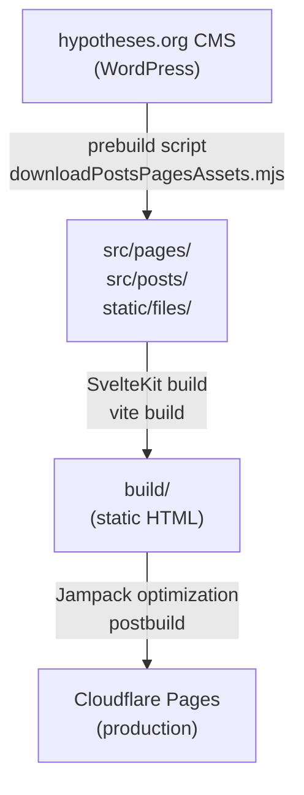
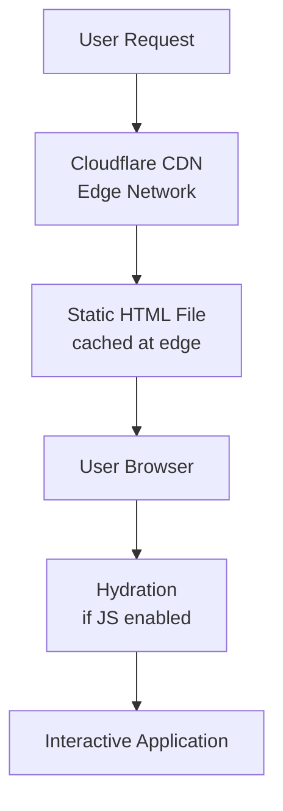

# Architecture Documentation

This document provides a detailed explanation of the stadtgeschichtebasel.ch architecture, design decisions, and technical implementation.

## Table of Contents

- [Overview](#overview)
- [Architecture Principles](#architecture-principles)
- [Technology Stack](#technology-stack)
- [Project Structure](#project-structure)
- [Data Flow](#data-flow)
- [Build Process](#build-process)
- [Deployment Pipeline](#deployment-pipeline)
- [Performance Optimizations](#performance-optimizations)
- [Accessibility Implementation](#accessibility-implementation)

## Overview

stadtgeschichtebasel.ch is a static site generator (SSG) application built with SvelteKit. It consumes content from a WordPress-based CMS (hypotheses.org) and generates a fast, accessible, and SEO-friendly static website deployed on Cloudflare Pages.

### Key Characteristics

- **Static Generation**: All pages are pre-rendered at build time
- **Headless CMS**: Content managed separately from the presentation layer
- **JAMstack Architecture**: JavaScript, APIs, and Markup
- **Progressive Enhancement**: Works without JavaScript, enhanced with JS
- **Accessibility-First**: WCAG 2.1 AA compliant

## Architecture Principles

### 1. Separation of Concerns

- **Content**: Managed in hypotheses.org CMS
- **Presentation**: SvelteKit components and routes
- **Data Processing**: Build-time scripts in `src/lib/`
- **Styling**: Tailwind CSS utility classes
- **Deployment**: Cloudflare Pages

### 2. Performance

- Static site generation for instant page loads
- Optimized images and assets
- Code splitting and lazy loading
- CDN distribution via Cloudflare
- Post-build optimization with Jampack

### 3. Maintainability

- Component-based architecture
- TypeScript for type safety
- Clear directory structure
- Conventional commits for version control
- Automated testing and CI/CD

### 4. Accessibility

- Semantic HTML
- ARIA attributes where needed
- Keyboard navigation support
- Screen reader compatibility
- High color contrast ratios

## Technology Stack

### Core Framework

- **[SvelteKit](https://kit.svelte.dev/)** (v2.x): Application framework
  - Static adapter for SSG
  - File-based routing
  - Server-side rendering capabilities
- **[Svelte](https://svelte.dev/)** (v4.x): UI component framework
  - Compile-time optimization
  - Reactive declarations
  - Component scoped styles

### Build Tools

- **[Vite](https://vitejs.dev/)** (v5.x): Development server and build tool
  - Fast HMR (Hot Module Replacement)
  - Optimized production builds
  - Plugin ecosystem

- **[Jampack](https://jampack.divriots.com/)**: Post-build optimization
  - Image optimization
  - Asset compression
  - Performance enhancements

### Styling

- **[Tailwind CSS](https://tailwindcss.com/)** (v3.x): Utility-first CSS framework
  - JIT (Just-In-Time) compiler
  - Custom configuration in `tailwind.config.ts`
- **[Skeleton UI](https://www.skeleton.dev/)**: Component library
  - Accessible components
  - Tailwind-based
  - Customizable themes

### Content Processing

- **[MDsveX](https://mdsvex.pngwn.io/)**: Markdown preprocessor
  - Markdown + Svelte components
  - Frontmatter support
  - Extensible with remark/rehype plugins

- **Remark/Rehype Plugins**:
  - `rehype-slug`: Add IDs to headings
  - `rehype-autolink-headings`: Linkable headings
  - `rehype-external-links`: Handle external links
  - `remark-captions`: Image captions

### Data Fetching

- **[node-fetch](https://github.com/node-fetch/node-fetch)**: HTTP requests
- **[cheerio](https://cheerio.js.org/)**: HTML parsing
- **[xml2js](https://github.com/Leonidas-from-XIV/node-xml2js)**: XML parsing
- **[turndown](https://github.com/mixmark-io/turndown)**: HTML to Markdown conversion

### Testing

- **[Playwright](https://playwright.dev/)**: E2E testing
  - Cross-browser testing
  - Screenshot comparison
  - Accessibility testing

- **[Vitest](https://vitest.dev/)**: Unit testing
  - Fast test runner
  - Jest-compatible API
  - Vite-powered

### Code Quality

- **[ESLint](https://eslint.org/)**: JavaScript/TypeScript linting
- **[Prettier](https://prettier.io/)**: Code formatting
- **[TypeScript](https://www.typescriptlang.org/)**: Type checking
- **[Husky](https://typicode.github.io/husky/)**: Git hooks
- **[Commitizen](https://commitizen-tools.github.io/commitizen/)**: Conventional commits

## Project Structure

```
stadtgeschichtebasel.ch/
├── .github/                    # GitHub configuration
│   ├── workflows/              # CI/CD pipelines
│   │   ├── sveltekitci.yml    # Main CI/CD workflow
│   │   ├── changelog.yml       # Automated changelog
│   │   ├── greetings.yml       # Welcome messages
│   │   └── label.yml           # Auto-labeling
│   ├── ISSUE_TEMPLATE/         # Issue templates
│   └── dependabot.yml          # Dependency updates
│
├── assets/                     # Static assets
│   └── images/                 # Documentation images
│
├── docs/                       # Documentation files
│   ├── FAQ.md                  # Frequently asked questions
│   └── ARCHITECTURE.md         # This file
│
├── src/                        # Source code
│   ├── lib/                    # Shared libraries
│   │   ├── components/         # Reusable Svelte components
│   │   ├── data/               # Data utilities
│   │   ├── images/             # Image processing
│   │   ├── config.js           # Configuration
│   │   ├── downloadManager.mjs # Download utilities
│   │   └── downloadPostsPagesAssets.mjs # Prebuild script
│   │
│   ├── routes/                 # SvelteKit routes
│   │   ├── +layout.svelte      # Root layout
│   │   ├── +page.svelte        # Homepage
│   │   └── [slug]/             # Dynamic routes
│   │
│   ├── pages/                  # CMS pages (generated)
│   ├── posts/                  # CMS posts (generated)
│   ├── params/                 # Route parameter matchers
│   ├── app.html                # HTML template
│   └── app.postcss             # Global styles
│
├── static/                     # Public files
│   └── files/                  # CMS assets (downloaded)
│
├── tests/                      # Test files
│   └── example.spec.js         # Playwright tests
│
├── svelte.config.js            # SvelteKit configuration
├── vite.config.js              # Vite configuration
├── tailwind.config.ts          # Tailwind configuration
├── mdsvex.config.js            # MDsveX configuration
├── playwright.config.js        # Playwright configuration
├── eslint.config.js            # ESLint configuration
├── package.json                # Dependencies and scripts
└── pnpm-lock.yaml              # Locked dependencies
```

### Key Directories Explained

#### `src/lib/`

Contains all reusable code:

- **`components/`**: Shared Svelte components (buttons, cards, navigation, etc.)
- **`data/`**: Data transformation and utility functions
- **`downloadPostsPagesAssets.mjs`**: Main prebuild script that fetches content from CMS

#### `src/routes/`

SvelteKit's file-based routing:

- `+page.svelte`: Page components
- `+layout.svelte`: Layout wrappers
- `+server.js`: API endpoints (if needed)
- `[slug]/`: Dynamic route segments

#### `src/pages/` and `src/posts/`

Generated by the prebuild script. Contains Markdown files with frontmatter:

```markdown
---
title: 'Page Title'
date: '2024-01-01'
---

Content here...
```

#### `static/`

Served as-is without processing:

- `static/files/`: Downloaded images and media from CMS
- Other static assets (favicon, robots.txt, etc.)

## Data Flow

### Content Pipeline



### Request Flow (Production)



## Build Process

### 1. Prebuild Phase

```bash
pnpm run prebuild
```

The `downloadPostsPagesAssets.mjs` script:

1. Fetches the sitemap from hypotheses.org
2. Parses all page and post URLs
3. Downloads HTML content for each URL
4. Converts HTML to Markdown (with frontmatter)
5. Downloads associated images and media
6. Saves everything to `src/pages/`, `src/posts/`, and `static/files/`

### 2. Development Build

```bash
pnpm run dev
```

Vite starts a development server with:

- Hot Module Replacement (HMR)
- On-demand compilation
- Fast refresh for Svelte components
- Source maps for debugging

### 3. Production Build

```bash
pnpm run build
```

SvelteKit/Vite:

1. Compiles all Svelte components
2. Processes Markdown files with MDsveX
3. Bundles and minifies JavaScript
4. Processes CSS with Tailwind and PostCSS
5. Optimizes assets
6. Pre-renders all pages to static HTML
7. Generates optimized build in `build/`

### 4. Post-Build Optimization

```bash
pnpm run postbuild
```

Jampack optimizes the build:

- Compresses images (WebP, AVIF)
- Minifies HTML, CSS, JS
- Adds resource hints
- Optimizes loading performance
- Generates responsive images

## Deployment Pipeline

### GitHub Actions Workflow

On push to `main` or pull request:

1. **Checkout**: Clone repository
2. **Setup**: Install Node.js and pnpm
3. **Install**: `pnpm install`
4. **Install Playwright**: For E2E tests
5. **Lint**: `pnpm run lint`
6. **Build**: `pnpm run build`
7. **Test**: `pnpm run test`
8. **Deploy**: (only on main) Deploy to Cloudflare Pages

### Deployment to Cloudflare Pages

When changes are merged to `main`:

- Build succeeds in CI
- Cloudflare Pages Action deploys the `build/` directory
- Content is distributed globally via Cloudflare's CDN
- Site is available at stadtgeschichtebasel.ch

### Environment Variables

Stored in GitHub Secrets:

- `CLOUDFLARE_API_TOKEN`: Cloudflare API authentication
- `CLOUDFLARE_ACCOUNT_ID`: Cloudflare account identifier

No runtime environment variables needed (static site).

## Performance Optimizations

### 1. Static Site Generation

- All pages pre-rendered at build time
- No server-side processing required
- Instant page loads

### 2. Code Splitting

SvelteKit automatically:

- Splits code by route
- Creates optimized chunks
- Lazy loads route components

### 3. Asset Optimization

- Images optimized with Jampack
- Modern formats (WebP, AVIF) with fallbacks
- Responsive images for different screen sizes
- Lazy loading of images

### 4. CSS Optimization

- Tailwind JIT compiler (only used classes)
- PurgeCSS removes unused styles
- PostCSS minification
- Critical CSS inlined

### 5. CDN Distribution

- Cloudflare's global network
- Edge caching
- Fast response times worldwide

### 6. Caching Strategy

- Immutable assets with cache busting
- Long cache times for static content
- Efficient cache invalidation

## Accessibility Implementation

### WCAG 2.1 AA Compliance

The project implements:

1. **Semantic HTML**
   - Proper heading hierarchy
   - Meaningful element usage
   - Landmark regions

2. **Keyboard Navigation**
   - All interactive elements keyboard-accessible
   - Visible focus indicators
   - Logical tab order

3. **Screen Reader Support**
   - ARIA labels where needed
   - Alt text for images
   - Descriptive link text

4. **Color and Contrast**
   - High contrast ratios (4.5:1 minimum)
   - No information conveyed by color alone
   - Tested with color blindness simulators

5. **Responsive Design**
   - Works on all screen sizes
   - Text scales appropriately
   - Touch targets are large enough

6. **Forms and Inputs**
   - Proper labels
   - Error messages
   - Clear instructions

### Testing for Accessibility

- Automated: Lighthouse, axe-core
- Manual: Keyboard testing, screen reader testing
- Tools: NVDA, JAWS, VoiceOver
- Continuous monitoring in CI/CD

## Design Decisions

### Why SvelteKit?

- **Performance**: Compile-time optimization
- **Developer Experience**: Simple, intuitive API
- **Static Generation**: Built-in SSG support
- **Bundle Size**: Smaller than React/Vue

### Why Static Site Generation?

- **Performance**: Pre-rendered pages load instantly
- **Security**: No server-side vulnerabilities
- **Scalability**: CDN handles any traffic level
- **Cost**: Cheap/free hosting on Cloudflare Pages

### Why Tailwind CSS?

- **Consistency**: Design system built-in
- **Performance**: Minimal CSS in production
- **Productivity**: Rapid development
- **Customization**: Easily themed

### Why Cloudflare Pages?

- **Performance**: Global CDN network
- **Reliability**: High uptime guarantee
- **Integration**: GitHub Actions support
- **Cost**: Free for this use case

## Future Considerations

### Potential Improvements

1. **Internationalization (i18n)**
   - Multi-language support
   - SvelteKit i18n integration

2. **Search Functionality**
   - Client-side search with Lunr.js
   - Or integration with external search service

3. **Progressive Web App (PWA)**
   - Service worker for offline support
   - App-like experience on mobile

4. **Content Preview**
   - Preview CMS changes before publishing
   - Staging environment

5. **Analytics**
   - Privacy-friendly analytics (Plausible, etc.)
   - User behavior insights

6. **Performance Monitoring**
   - Real User Monitoring (RUM)
   - Synthetic monitoring

## Conclusion

This architecture provides a solid foundation for a high-performance, accessible, and maintainable website. The separation of concerns, modern tooling, and focus on performance and accessibility ensure a great experience for both developers and end-users.

For questions or suggestions about the architecture, please open a [GitHub Discussion](https://github.com/Stadt-Geschichte-Basel/stadtgeschichtebasel.ch/discussions).
